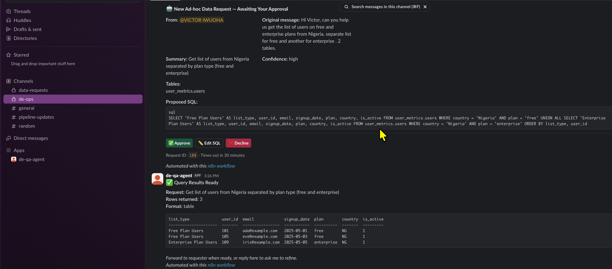
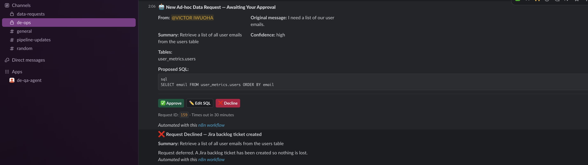
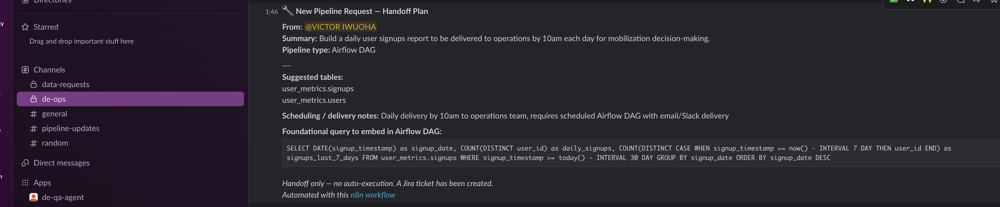
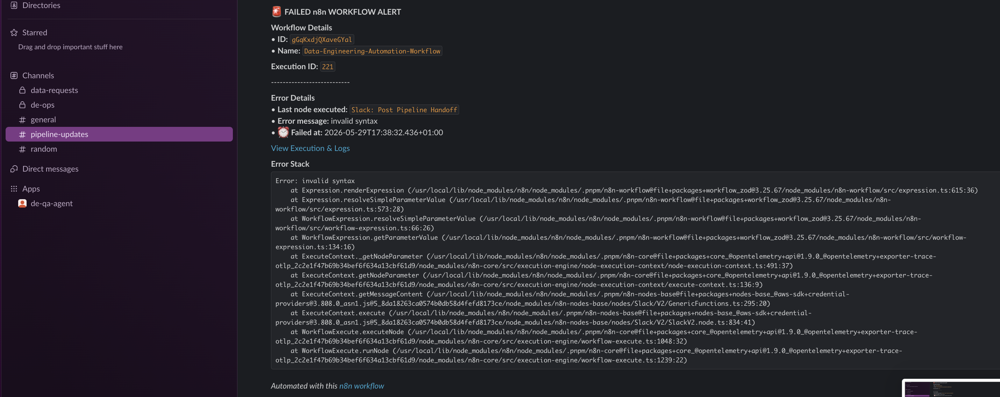
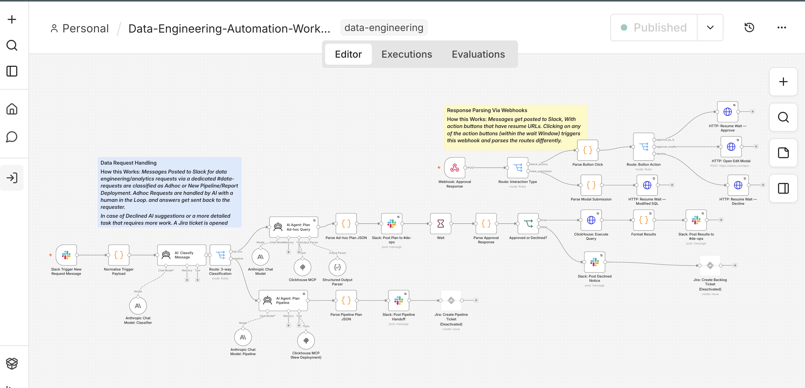
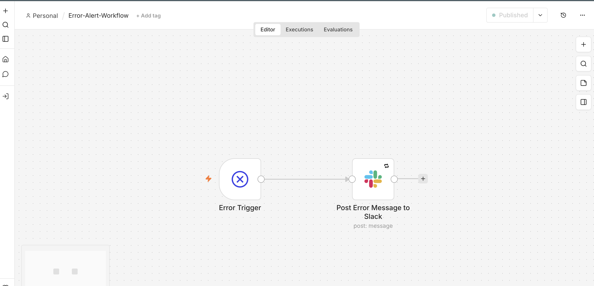

# DE Agent - n8n + ClickHouse + Slack

> Built by **[Victor Iwuoha](https://www.linkedin.com/in/viciwuoha)** - Senior Data Engineer.

An automated data engineering workflow that listens to Slack data requests,
classifies them with AI, plans and executes ClickHouse queries, and routes
results back through a human-in-the-loop approval flow before delivery.


## Table of Contents

- [Background](#background)
- [Stack](#stack)
- [How it works](#how-it-works)
- [Customisation](#customisation)
- [Prerequisites](#prerequisites)
- [Quick Start](#quick-start)
- [Environment variables](#environment-variables)
- [ClickHouse options](#clickhouse-options)
- [Project structure](#project-structure)
- [Security notes](#security-notes)
- [Going to production](#going-to-production-gcp)
- [Roadmap / Future improvements](#roadmap--future-improvements)

---

## Background

As a Senior Data Engineer, with over 7 years of experience in the data space, I have seen that ad-hoc data requests from stakeholders are a constant reality, especially, if your role involves interfacing with them. And while individually small, they are collectively time-consuming and pull focus away from higher-value and deep work. This workflow automates the repetitive and occasionally boring parts: understanding the request, finding the right tables, writing the SQL, and returning results - while keeping a human in the loop for review before anything runs. Think of it like employing your own personal assistant while getting your job done.

👇 **Skip the docs for now - see it running first.**

<details>
<summary><strong>Workflow Outputs - Live Slack examples</strong></summary>

**Ad-hoc query approved - plan posted with buttons, results returned**



**Ad-hoc query declined - request deferred, Jira backlog ticket created**



**Pipeline request - handoff plan posted to #de-ops**



**Workflow failure - error alert posted to #pipeline-updates**



</details>

---

## Stack

| Service | Purpose |
|---------|---------|
| **[n8n](https://n8n.io)** | Workflow orchestration |
| **ClickHouse** | Local analytics data warehouse ([Running in Docker](https://clickhouse.com/docs/install/docker)) |
| **[mcp-clickhouse](https://github.com/ClickHouse/mcp-clickhouse)** | ClickHouse MCP server - schema lookup + query planning |
| **[ngrok](https://ngrok.com)** | Exposes n8n webhooks to Slack over the public internet |

---

## How it works

1. A message in `#data-requests` triggers the workflow
2. **Claude Sonnet 4.6** classifies it as `AD_HOC_QUERY`, `PIPELINE_REQUEST`, or `NOT_RELEVANT`
3. **Ad-hoc path**: **Claude Sonnet 4.5** introspects ClickHouse schema via MCP tools (`list_databases`, `list_tables`, `run_select_query`), writes SQL, and posts a plan to `#de-ops` with three interactive buttons:
   - **✅ Approve** - runs the AI-proposed SQL as-is, results posted back to `#de-ops`
   - **✏️ Edit SQL** - opens a Slack modal to modify the SQL before running, results posted back to `#de-ops`
   - **❌ Decline** - posts a declined notice to `#de-ops` and creates a Jira backlog ticket so nothing is lost (Jira node disabled by default)
4. On approval, ClickHouse executes the query and results are posted to `#de-ops`
5. **Pipeline path**: **Claude Sonnet 4.5** plans a handoff (dbt model / Airflow DAG / Jasper report), posts it to `#de-ops`, and creates a Jira ticket for the team to pick up (Jira node disabled by default).
6. **Failure alerting**: A separate `Error-Alert-Workflow` is configured as an [n8n error workflow](https://docs.n8n.io/flow-logic/error-handling/). If any node in the main workflow fails, n8n triggers this workflow automatically and posts a structured alert to `#pipeline-updates` with the workflow name, execution ID, last node executed, error message, stack trace, and a direct link to the failed execution in n8n. To wire it up: open the main workflow settings → **Error Workflow** → select `Error-Alert-Workflow`.





---

## Customisation

- **AI model** - all three AI nodes (classifier, ad-hoc query agent, pipeline planning agent) use Claude via the Anthropic credential in n8n. Swapping to OpenAI (GPT-4o, GPT-4.1, etc.) requires only changing the language model sub-node on each agent - the rest of the workflow is model-agnostic.
- **Data warehouse** - ClickHouse is the default, but the query execution step is a plain HTTP Request node. Any warehouse that exposes an HTTP API (BigQuery, Snowflake, Redshift, DuckDB, etc.) can be substituted by updating the `ClickHouse: Execute Query` node URL, headers, and auth to match your target system. The MCP server would also need to be replaced with one that introspects your chosen warehouse's schema.
- **AI prompts** - the system prompts for all three agents (`AI: Classify Message`, `AI Agent: Plan Ad-hoc Query`, `AI Agent: Plan Pipeline`) are plain text fields editable directly in n8n. Adjust classification rules, add domain-specific context, change the output JSON schema, or restrict which databases the agent is allowed to query.
- **Output format and parsing** - query results are formatted in the `Format Results` Code node using plain JavaScript, and the output format (`table`, `csv`, or `summary`) is driven by the `output_format` field returned by the AI plan. Both the formatting logic and the Slack message templates can be adjusted to match your team's preferred structure. The JSON parsing in `Parse Ad-hoc Plan JSON` and `Parse Pipeline Plan JSON` is also plain JavaScript and can be extended if you change the AI output schema.

---

## Prerequisites

- Docker + Docker Compose
- [ngrok account](https://dashboard.ngrok.com) - **Hobby plan recommended** (free tier has request limits that are easily exhausted by Slack retries)
- Anthropic API key (Claude Sonnet - used for all AI nodes: classifier, ad-hoc query agent, and pipeline planning agent)
- Slack app with bot token, event subscriptions, and interactivity enabled

---

## Quick Start

### 1. Clone and configure

```bash
git clone https://github.com/your-org/de-agent
cd de-agent
cp sample.env .env
```

Edit `.env` with your values - see comments in the file for where to get each one.

### 2. Get your ngrok static domain

Sign up at ngrok.com → Dashboard → Cloud Edge → Domains → **Create domain**.
Set it in `.env`:
```
NGROK_STATIC_DOMAIN=your-name-abc123.ngrok-free.app
WEBHOOK_URL=https://your-name-abc123.ngrok-free.app
```

> **Note**: Upgrade to the ngrok Hobby plan (~$8/month) before going live. The free tier request quota is exhausted quickly by Slack's webhook retry behaviour.

### 3. Start the stack

```bash
docker compose up -d
```

### 4. Seed ClickHouse with sample data (optional)

```bash
docker exec -i de-agent-clickhouse-1 clickhouse-client \
  --user default --password your-clickhouse-password < sql/seed.sql
```

You can also preview the data generated via the Clickhouse UI at http://localhost:8123/play. You will need to enter the password used at setup for the default user.

### 5. Open n8n

Navigate to `http://localhost:5678` and log in with the credentials from your `.env`.

### 6. Import the workflow

In n8n: Go to **Create Workflow** → click the three dots in the top-right → **Import from file** → select `workflows/Data-Engineering-Automation-Workflow.json`.

After importing, multiple nodes will show errors until credentials and channels are updated — this is expected. Fix them in the following steps before publishing.

Once all credentials and channels are set, **Publish the workflow** (top right — the yellow dot should turn green). Webhooks are only registered when the workflow is active.

### 7. Configure n8n credentials

In n8n: **Settings → Credentials**, add:
- **Anthropic API** - your API key from console.anthropic.com
- **Slack OAuth2** - your Slack bot token

### 8. Configure your Slack app

In your Slack app settings (`api.slack.com/apps`):

**Event Subscriptions → Request URL**:
```
https://your-ngrok-domain/webhook/<your-slack-trigger-webhook-id>/webhook
```
> The webhook ID is auto-generated by n8n when you import the workflow and will be unique to your instance. Find it by opening the `Slack Trigger New Request Message` node - the full URL is shown in the node's **Webhook URLs** field.

Subscribe to bot events: `message.channels`, `app_mention` and `message.groups` or any other event depending on your use-case.

**Interactivity & Shortcuts → Request URL**:
```
https://your-ngrok-domain/webhook/de-agent-approval
```

Reinstall the app to your workspace after saving.

> **Note**: Use `/webhook/` (production) URLs when the workflow is active. Use `/webhook-test/` only when running individual node tests inside n8n. Also note that the interactive Approve/Decline/Edit SQL buttons only work when you use the production URLs in your Slack app's `Event Subscriptions` & `Interactivity & Shortcuts` settings.

---

## Environment variables

Key variables in `.env` - all are passed to the n8n container via `docker-compose.yml`:

| Variable | Description |
|----------|-------------|
| `WEBHOOK_URL` | Public URL n8n registers webhooks on (your ngrok domain) |
| `NGROK_STATIC_DOMAIN` | ngrok static domain (no `https://` prefix) |
| `NGROK_AUTHTOKEN` | ngrok auth token |
| `N8N_USER` / `N8N_PASSWORD` | n8n login credentials |
| `N8N_ENCRYPTION_KEY` | Random secret for encrypting n8n credentials at rest |
| `CLICKHOUSE_HOST` | `clickhouse` (Docker service name) |
| `CLICKHOUSE_USER` / `CLICKHOUSE_PASSWORD` | ClickHouse credentials |
| `CLICKHOUSE_MCP_URL` | `http://mcp:8000/mcp` |
| `SLACK_BOT_TOKEN` | Slack bot token (used by the Edit SQL modal) |
| `N8N_BLOCK_ENV_ACCESS_IN_NODE` | Set to `false` - allows nodes to read `$env.*` variables |
| `N8N_DIAGNOSTICS_ENABLED` | Set to `false` to disable n8n telemetry |

---

## ClickHouse options

### Local ClickHouse via Docker Compose (default)
Already included in `docker-compose.yml`. Runs on ports `8123` (HTTP) and `9000` (native).
Use `sql/seed.sql` to create sample databases and tables.

### ClickHouse Cloud
Sign up for a free 30-day Development tier at cloud.clickhouse.com.
Update `.env`:
```
CLICKHOUSE_HOST=your-instance.clickhouse.cloud
CLICKHOUSE_PORT=8443
CLICKHOUSE_SECURE=true
CLICKHOUSE_VERIFY=true
```

### MCP server: local package vs ClickHouse Cloud remote MCP

These are two distinct integrations with different tool sets and auth models - they are **not interchangeable by just swapping a URL**.

| | **Local `mcp-clickhouse`** (this project) | **ClickHouse Cloud remote MCP** |
|---|---|---|
| Hosting | Self-hosted Docker container | Fully managed by ClickHouse |
| Auth | Username + password via env vars | OAuth 2.0 (browser-based flow) |
| Tools | 3: `run_select_query`, `list_databases`, `list_tables` | 13: adds service management, backup monitoring, ClickPipes visibility, billing data |
| Transport | HTTP / SSE / stdio | HTTPS (remote endpoint) |
| Use case | Local dev, self-hosted ClickHouse | ClickHouse Cloud customers |

This project uses the **local package** running as a Docker container (`mcp` service in `docker-compose.yml`). If you switch to ClickHouse Cloud and want to use its managed remote MCP instead, the `CLICKHOUSE_MCP_URL` alone is not sufficient - you will also need to update the MCP client node in n8n to handle OAuth, and the AI agent's system prompt may need updating since the Cloud remote MCP exposes different tool names than the local package.

> **SSE vs HTTP Streamable transport**: The MCP specification deprecated the SSE transport (`/sse` endpoint) in 2025 and replaced it with [Streamable HTTP](https://modelcontextprotocol.io/specification/2025-11-25/basic/transports#streamable-http) (`/mcp` endpoint). n8n added Streamable HTTP support in July 2025. This project uses the `/mcp` endpoint - do not use `/sse` for new setups.

---

## Project structure

```
de-agent/
├── docker-compose.yml                      # Full stack definition
├── sample.env                              # Copy to .env and fill in values
├── workflows/
│   ├── Data-Engineering-Automation-Workflow.json  # Main DE agent workflow
│   └── Error-Alert-Workflow.json                  # n8n error alert workflow
├── assets/
│   ├── DE-Automation-Workflow.png          # Main workflow screenshot
│   ├── Error-Workflow.png                  # Error alert workflow screenshot
│   └── slack/                              # Live Slack output screenshots
├── mcp/
│   └── Dockerfile                          # ClickHouse MCP server image
├── sql/
│   └── seed.sql                            # Sample schema + dummy data
└── README.md
```

---

## Security notes

- **Least-privilege database user** - the ClickHouse user configured in `.env` should be a dedicated read-only account with access scoped to only the schemas the agent needs. Avoid using the default admin user in any shared or production environment.
- **Webhook authentication** - enable authentication on n8n webhooks where possible. The `Webhook: Approval Response` node and the Slack trigger currently accept unauthenticated POST requests; in production, add header-based auth or verify the Slack signing secret.
- **ngrok exposure** - the free tier exposes your local n8n instance publicly with minimal access controls. Upgrade to the Hobby plan or switch to a proper tunnel solution before sharing the URL with anyone outside your team.

---

## Going to production (GCP)

Replace ngrok with a **Cloud Run Service** or a **Cloudflare Tunnel** (requires a domain).
Deploy n8n on a GCP VM or Cloud Run. Update `WEBHOOK_URL` to your production URL
and update both Slack app URLs accordingly.

---

## Roadmap / Future improvements

- **Google Sheets export** - after each approved query, create a new tab (named `{date} - {query summary}`) in a shared "DE Agent Results" spreadsheet and post a deep-link to the tab alongside the inline Slack preview. Avoids the clutter of appending all results to a single sheet.
- **Column-aligned result formatting** - pad columns to fixed widths in the Slack code block for easier reading when result sets have varying value lengths.
- **Pipeline double-message fix** - investigate whether `AI Agent: Plan Pipeline` ever returns multiple output items in a single execution, causing the handoff message to be sent more than once.
- **Jira integration** - enable the disabled Jira nodes (`Jira: Create Pipeline Ticket`, `Jira: Create Backlog Ticket`) once Jira credentials are configured in n8n.
- **Agent memory** - attach a memory store to the AI agent nodes so they can recall similar past requests and avoid regenerating the same queries repeatedly.
- **Knowledge base enrichment** - connect dbt model definitions, DataHub lineage notes, or a data dictionary to the agent as additional context, improving SQL accuracy and table selection for complex domains.
